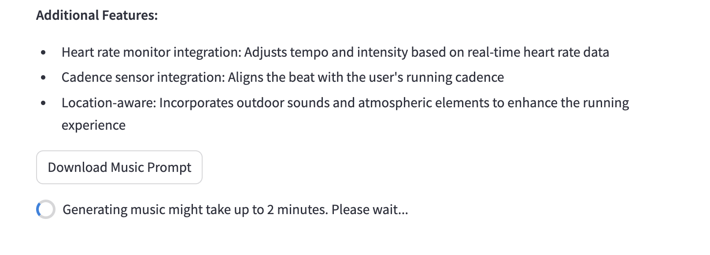
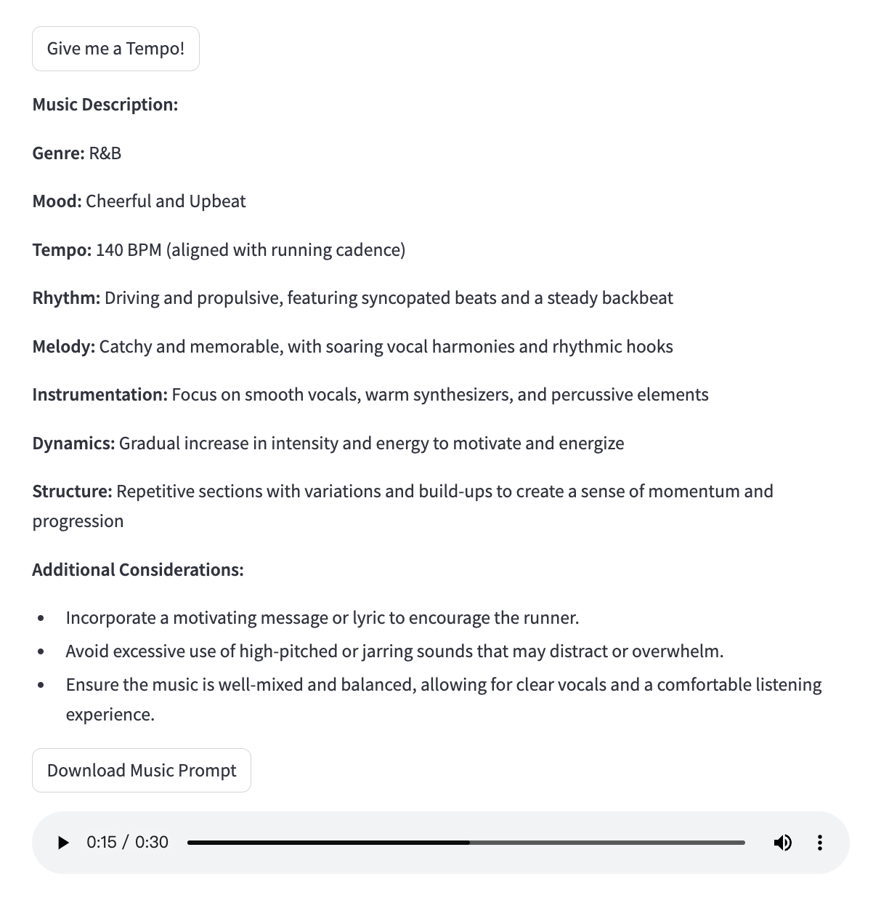

# MusicGen for Running

A real-time running music generator that can take the user’s request and give a professional music clip in 2 minutes. Users can directly download the music description text file and the music mp3 file.

## Getting Started

### First time setup

```bash
# Create virtual environment
python -m venv venv

# Activate virtual environment
source venv/bin/activate

# Install dependencies
pip install -r requirements.txt
```

### Future runs

```bash
# Activate virtual environment
source venv/bin/activate

# Run the app
streamlit run llm_app.py
```

### Music Generation using Meta API
It will take 2 minutes to generate a 30-second music clip. please wait.



Final result:



## Lessons Learned
Updated my prompt template using learned techniques

Added Meta MusicGen API (using replicate) so that the web app can direct generated music based on the generated prompt, and display the music

## Future Improvements
Receive real-time data from AWS and input them into the template instead of manually choosing the cadence and heart rate.